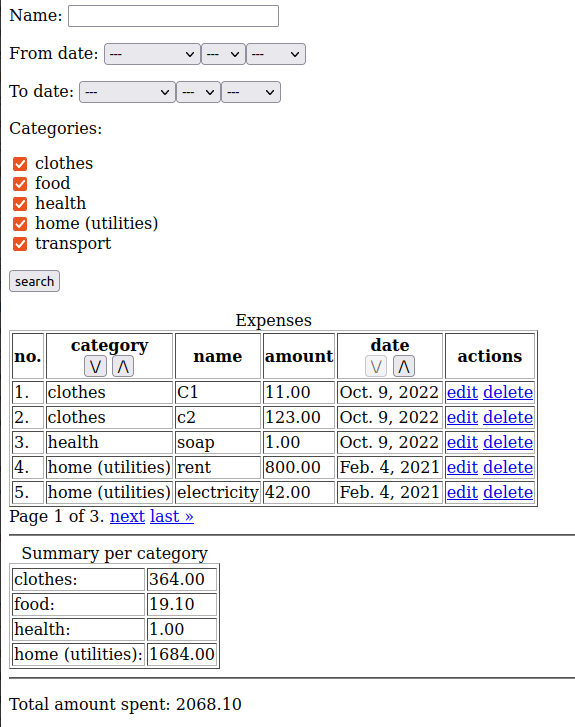
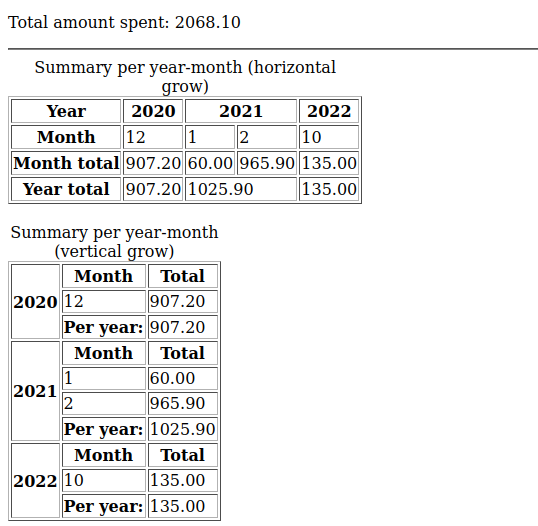

# Expenses
 
Example of using Django template with filtering. Add expenses, categories and see how much you've spent per month/year.

## Filtering & sorting

The filtering using Djnago's querysets and filters. Sorting buttons done using separate temple to add direction buttons as table's labels.

## Summary

The summary done using queryset, filterings, reversed foreign-key relation, and Python's list/dict comprehension.

